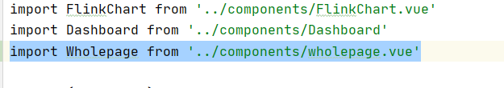
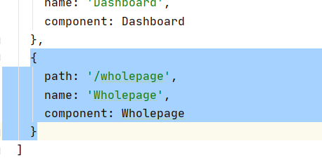

### 添加的文件
visualization/frontend/src/components目录下的
1. chartname.vue 
2. chart.vue 
3. advice.vue
4. onepiece.vue
5. wholepage.vue

1、2、3是构成4的组件

4是构成5的组件

### 修改的文件
visualization/frontend/src/router目录下的index.js

####修改的文件中添加的代码(共2处添加)

### 发生的问题
当index.js文件中添加的部分去掉时，可以正常运行，添加上这段代码之后，启动项目，打开网页后显示一片空白